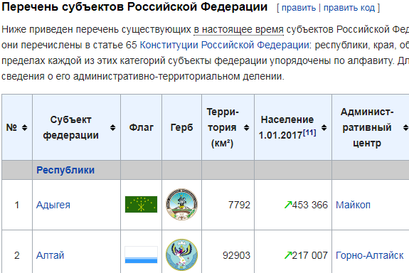
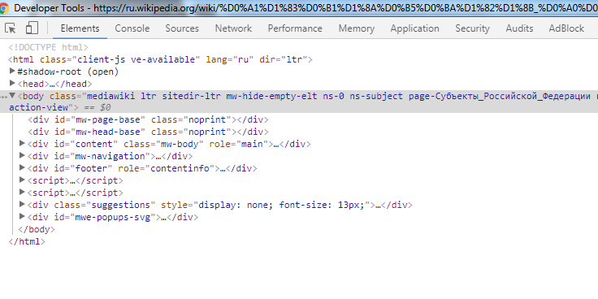
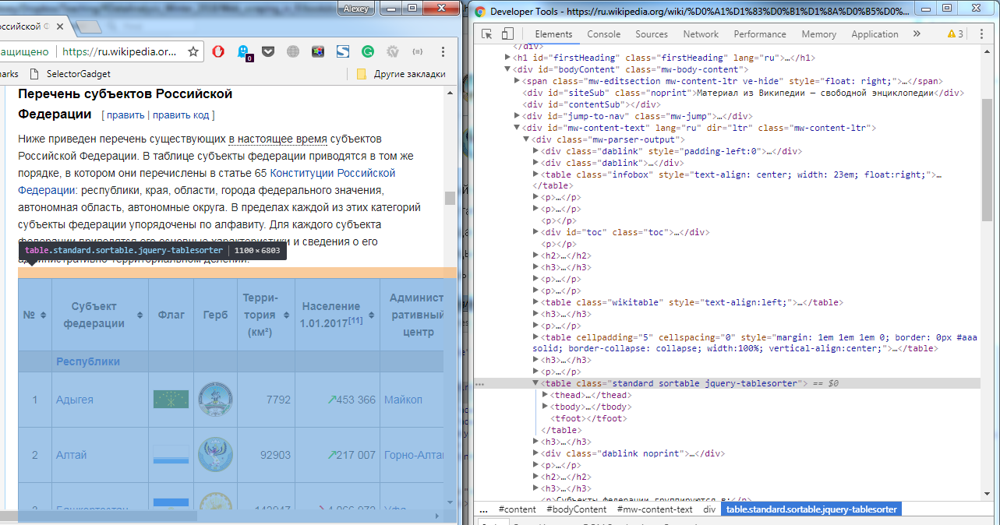
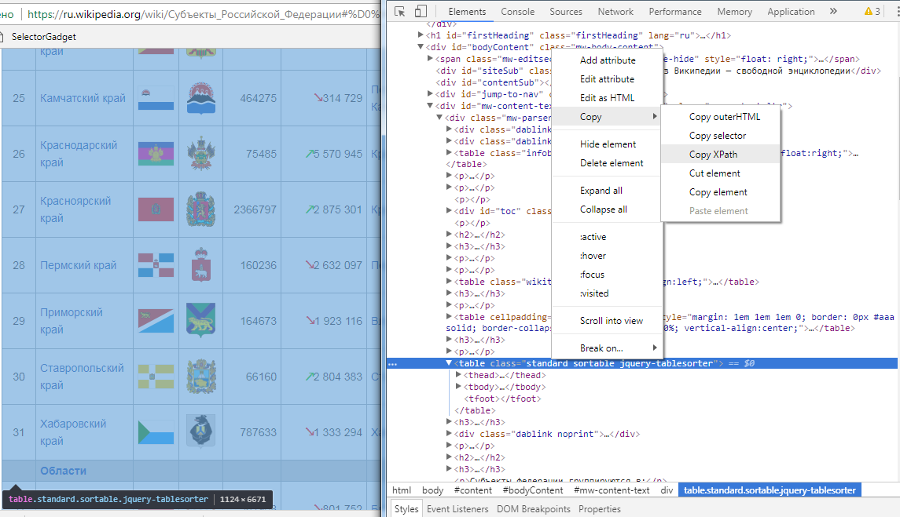
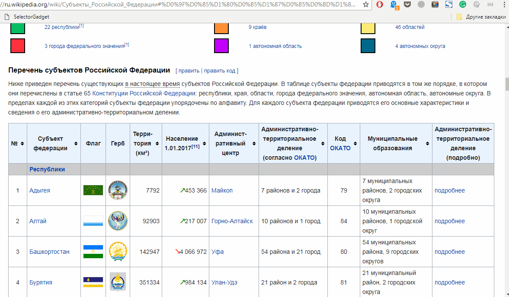

# Easy way: rvest

## Структура сайтов и HTML

Итак, допустим, вам нужно спарсить какие-то данные с какого-нибудь сайта. Чаще всего это значит, что вам нужна таблица на странице, какой-то ряд данных или определённые абзацы текста. В целом, большинство задач по скрэпингу данных заключаются в том, чтобы из одной или нескольких веб-страниц получилась чистая (когда каждый столбец соответствует переменной, а строка -- отдельному наблюдению) таблица или датафрейм. Давайте начнём с простого и попробуем подумать, как скопировать таблицу, содержащую список субъектов Российской Федерации с населением, с соответствующей [страницы](https://ru.wikipedia.org/wiki/%D0%A1%D1%83%D0%B1%D1%8A%D0%B5%D0%BA%D1%82%D1%8B_%D0%A0%D0%BE%D1%81%D1%81%D0%B8%D0%B9%D1%81%D0%BA%D0%BE%D0%B9_%D0%A4%D0%B5%D0%B4%D0%B5%D1%80%D0%B0%D1%86%D0%B8%D0%B8#%D0%9F%D0%B5%D1%80%D0%B5%D1%87%D0%B5%D0%BD%D1%8C_%D1%81%D1%83%D0%B1%D1%8A%D0%B5%D0%BA%D1%82%D0%BE%D0%B2_%D0%A0%D0%BE%D1%81%D1%81%D0%B8%D0%B9%D1%81%D0%BA%D0%BE%D0%B9_%D0%A4%D0%B5%D0%B4%D0%B5%D1%80%D0%B0%D1%86%D0%B8%D0%B8) Википедии.^[Правильный ответ -- это обратиться к источнику данных, на который ведёт сноска в той же табличке: скачать сборник Росстата, найти там нужный Excel-файл и работать с ним.  Однако допустим, что такой сноски нет.]  





Давайте посмотрим на исходный код, чтобы понять, где находится эта таблица в представлении программы, которая потом эту таблицу скачает и сохранит. В любом современном браузере есть режим просмотра исходного кода (правой кнопкой мыши по странице в Chrome -- "Просмотреть код", в Firefox -- "Исходный код страницы", но можно просто нажать F12). Если перейти к этому режиму, то нам откроется начинка веб-страницы.



Перед нами -- структура исходного кода HTML-страницы. HTML -- это язык разметки, с помощью которого браузер понимает, как размещать картинки, текст, таблицы и другое содержание на веб-странице. Иными словами, HTML задачёт структуру страницы. В этой структуре есть много уровней вложенности, и на одном из уровней лежит нужная нам таблица. В режиме просмотра исходного кода можно видеть, за какой компонент отрисованной браузером и пригодной для обычного человека страницы отвечает тот или иной кусок блока. Для этого можно расположить рядом окно самой страницы с табличкой и окно просмотрщика исходного кода:



Раскрывая стрелочками наш блок с таблицей всё дальше и дальше, мы придём к отдельным строкам для каждого субъекта. Мы нашли наши данные, что делать дальше?

## XPath и CSS селекторы: пробиваем путь к данным

Нужно дать программе (о самой программе чуть позже) понять, какой именно блок страницы нам нужен. Есть два способа это сделать.  

Первый способ -- использовать [XPath](https://ru.wikipedia.org/wiki/XPath). Это такой язык для запросов к XML-документам, который применим и для HTML-страниц. Он позволяет описать, какой именно элемент нам нужен. В случае с таблицей из Википедии XPath выглядит так:

`//*[@id="mw-content-text"]/div/table[4]`

Его можно получить из просмотрщика исходного кода в браузере:  



Второй способ -- использовать селекторы CSS. Если говорить просто, селекторы -- это такие ярлыки внутри HTML-страницы, которые навешаны на разные блоки информации внутри страницы, чтобы определенным образом менять форматирование текста, картинок или чего-либо еще. Они бывают разных типов, несколько селекторов могут применяться к одному и тому же блоку внутри страницы одновременно, но самое главное, что с их помощью мы тоже можем указывать, что именно нам нужно. На предыдущей картинке прямо над кнопкой копирования XPath есть такая же кнопка "Copy selector". Посмотрим, что он скопирует: 

`#mw-content-text > div > table.standard.sortable.jquery-tablesorter`


Есть еще более простой способ получать XPath -- с помощью небольшого инструмента [SelectorGadget](http://selectorgadget.com/). Это маленький JS-скрипт, который автоматически (хотя иногда *неуклюже*) выделяет путь до нужного элемента. Сначала этот скрипт нужно перетянуть на панель задач (смотрите предыдущую ссылку) - это достаточно сделать один раз. Переходим на нужный сайт (в нашем случае -- страничку на Википедии), нажимаем на SelectorGadget, он подгружается, и после этого нажимаем на ту область, откуда нам нужно сохранить данные. Нажатая область подсветится зелёным. А жёлтым подстветится то, что selectorgadget считает тем, что нам нужно. Если в желтую область попадает что-то, что нам не нужно, на это нажимаем еще раз и оно становится красным (и, значит, не попадёт к нам). В конце важно проверить, чтобы на всей странице желтым окрашены были только те данные, которые нам нужны.

<!-- -->


Получили Xpath с помощью SelectorGadget'a, правда, неуклюжий, и, если его проверить, то неработающий. Селекторгаджет хорошо работает, когда нужно выделить хитрую комбинацию значений из страницы, но не всегда. Я говорил, что скрэпинг - грязное дело. 

`//*[contains(concat( " ", @class, " " ), concat( " ", "unsortable", " " ))] | //*[contains(concat( " ", @class, " " ), concat( " ", "jquery-tablesorter", " " ))]//td//*[contains(concat( " ", @class, " " ), concat( " ", "headerSort", " " ))]`


Теперь можно расчехлять R и, наконец начать писать код для скрэпинга.

## Rvest

Раньше для парсинга веб-страниц использовалась связка из библиотеки `xml2` и `httr`: первая позволяет работать с XML-деревом, а вторя -- обмениваться запросами с сайтами и получать HTML-код. Великий Хэдли Уикхэм написал оболочку над этими библиотеками, которая называется `rvest` и позволяет здорово экономить код и пространства имён.  

У этой библиотеки есть разные функции (в том числе для работы с формами, в том числе с формами Google), но главные из них -- это `html_read()`, которая получает код веб-страницы, и `html_nodes()`, которая выбирает нужные нам блоки из HTML-структуры страницы. Кроме того, очень полезная функция `html_table()`, которая умеет преобразовывать HTML-таблицы в обычные для R датафреймы. Давайте попробуем заскрэпить нашу таблицу с населением субъектов РФ.

Устанавливаем rvest: 
`install.packages("rvest")`


```r
library(rvest)
```

```
## Загрузка требуемого пакета: xml2
```

```r
# URL страницы
# https://ru.wikipedia.org/wiki/Субъекты_Российской_Федерации
wiki_url <- "https://ru.wikipedia.org/wiki/%D0%A1%D1%83%D0%B1%D1%8A%D0%B5%D0%BA%D1%82%D1%8B_%D0%A0%D0%BE%D1%81%D1%81%D0%B8%D0%B9%D1%81%D0%BA%D0%BE%D0%B9_%D0%A4%D0%B5%D0%B4%D0%B5%D1%80%D0%B0%D1%86%D0%B8%D0%B8"

# XPath, который мы вручную взяли из исходного кода HTML-страницы
wiki_xpath <- '//*[@id="mw-content-text"]/div/table[4]'

wiki_table <- wiki_url %>% read_html() %>% html_node(xpath = wiki_xpath) %>% html_table()
head(wiki_table)
```

```
##          № Субъект федерации Флаг Герб Терри-\nтория (км<U+00B2>) Население\n1.01.2017[11] Админист-\nративный центр Административно-территориальное деление\n(согласно ОКАТО) Код ОКАТО                     Муниципальные образования Административно-территориальное деление (подробно)
## 1 0.000001        Республики   NA   NA                         NA                                                                                                                                                                                                                        
## 2 1.000000            Адыгея   NA   NA                       7792          <U+2197>453 366                    Майкоп                                      7 районов и 2 города        79   7 муниципальных районов, 2 городских округа                                          подробнее
## 3 2.000000             Алтай   NA   NA                      92903          <U+2197>217 007             Горно-Алтайск                                      10 районов и 1 город        84   10 муниципальных районов, 1 городской округ                                          подробнее
## 4 3.000000      Башкортостан   NA   NA                     142947        <U+2198>4 066 972                       Уфа                                      54 района и 21 город        80  54 муниципальных района, 9 городских округов                                          подробнее
## 5 4.000000           Бурятия   NA   NA                     351334          <U+2197>984 134                  Улан-Удэ                                       21 район и 2 города        81    21 муниципальный район, 2 городских округа                                          подробнее
## 6 5.000000          Дагестан   NA   NA                      50270        <U+2197>3 041 900                 Махачкала                                     41 район и 10 городов        82 42 муниципальных района, 10 городских округов                                          подробнее
```


Вот и всё, у нас есть датафрейм, который нужно немного почистить и он будет готовым набором данных.  
Давайте разберём, что произошло в этой строке:
`wiki_table <- wiki_url %>% read_html() %>% html_node(xpath = wiki_xpath) %>% html_table()`
Здесь используется оператор пайплайна (*трубопроводчик?*) из библиотек `magrittr/dplyr`: `%>%` 
  
<!-- -->
  
`%>%` позволяет сильно упрощать код. Код для получения таблицы из Википедии, написанный традиционным способом, но в одну строку, выглядел бы вот так:

`wiki_table <- html_table(html_node(read_html(wiki_url), xpath = wiki_xpath))`

Выглядит сложнее и непонятнее. Так что же происходит в той трубе для получения таблицы из Википедии?  
`wiki_table <- wiki_url %>% read_html() %>% html_node(xpath = wiki_xpath) %>% html_table()`  
Сначала мы берём `wiki_url`, адрес веб-страницы, этот адрем передаётся функции `read_html()`, которая обращается к серверу Википедии и получает исходный HTML-код. Затем этот код передаётся функции `html_node()` вместе с путём, по которому расположена наша таблица  `wiki_xpath`, и на выходе получаем тот кусок HTML-кода, который и находится по этому адресу. Наконец, нам надо преобразовать этот кусок в привычный для R датафрейм с помощью `html_table()`, что мы успешно и делаем.

