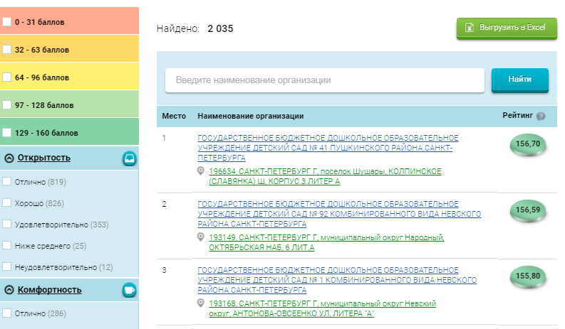
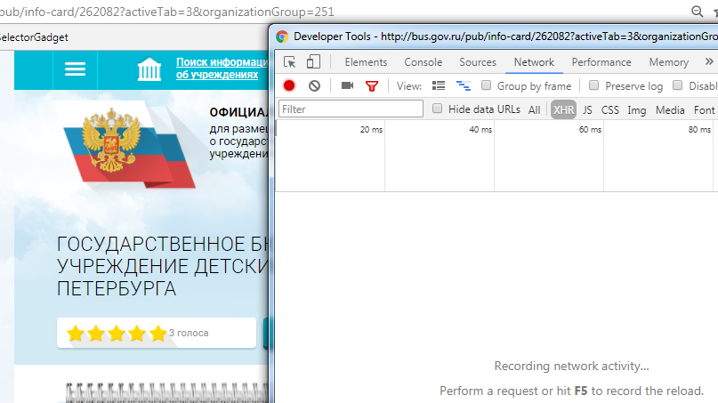
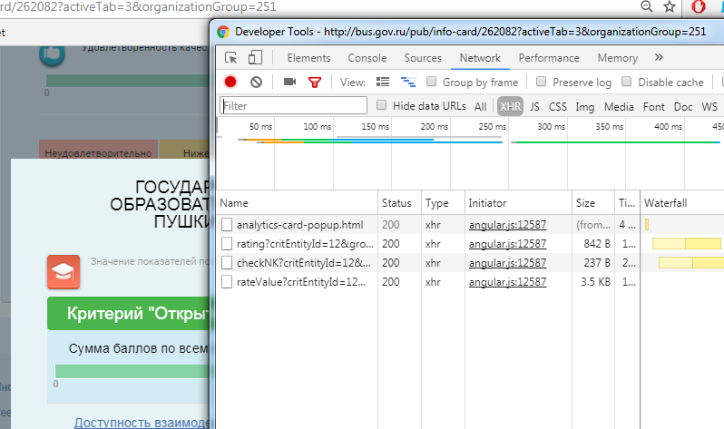
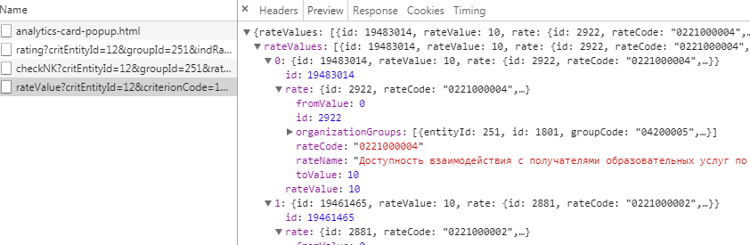

# Hard way: httr+jsonlite


В последние годы веб-страницы всё реже являются статичными и всё чаще используют AJAX -- набор технологий для асинхронной работы с JavaScript и XML, когда мы один раз загружаем страницу в браузер и, например, выбираем какие-нибудь фильтры для отображающихся таблиц. Это удобно для пользователей, потому что не нужно каждый раз перезагружать страницу заново, и удобно для разработчиков, поскольку на сервер приходится меньше нагрузки; кроме того, это позволяет делать прикольные интерактивные штуки с тем, что происходит на странице.  
Однако это создаёт проблему для людей, которые хотят соскрэпить данные с веб-страницы, то есть для нас. Страница в момент первого обращения (то есть когда мы делаем запрос с помощью функции `read_html` в `rvest`) не содержит нужных нам данных, они подгружаются чуть позже, когда выполняется скрипт JavaScript. Что же делать?  
  
Я знаю о двух способах решения этой задачи. Первый заключается в том, чтобы найти вторичные запросы JS-скриптов, которые подгружают данные к нам на страницу, если мы сидим через браузер. Часто это непростая задача, потому что таких скриптов и обращений может быть много, и чтобы их найти нужно покопаться и найти нужное. Такой способ я покажу в этой главе, а про второй расскажу в следующей.  
  
В качестве примера я возьму портал Федерального казначейства России, посвященный информации о государственных и муниципальных закупках -- [bus.gov.ru](http://bus.gov.ru/pub/home).  
Пара моих знакомых занимается исследованиями образования, и они были в ужасе от того, что им придётся вручную копировать больше тысячи записей о рейтингах школ Санкт-Петербурга, которые есть на bus.gov.ru.  Когда я узнал об этом, я сказал: "Фигня вопрос, это делается за вечер". В действительности это заняло примерно в 5 раз больше времени. Про этот опыт и будет пример со скрэпингом веб-страниц с асинхронной загрузкой данных.

## bus.gov.ru и задачка для выгрузки данных

Задача звучит так. Есть [страница](http://bus.gov.ru/pub/top-organizations), содержащая учреждения начального и среднего образования Санкт-Петербурга (нужно выбрать кнопку "Образование", а субъект -- "Санкт-Петербург").



При переходе на [страничку](http://bus.gov.ru/pub/info-card/262082?activeTab=3&organizationGroup=251) детского сада №41 в Пушкинском районе (первая страница в списке) показывается много всяких интересных данных об этом детском саде. Особенно интересна маленькая незаметная кнопка "Значения показателей" внизу карточку, при нажатии на которую появляются окошко-фрейм с суммами баллов, которые, по какой-то причине, все равны 10 из 10 (это моих знакомых и заинтересовало больше всего).  
Задача: как выгрузить все эти показатели для всех элементов списка в плоскую таблицу для анализа? 
  
Правильный ответ: разобраться в [открытых данных](http://bus.gov.ru/pub/open-data) портала bus.gov.ru, скачать нужные XML и распарсить их. Пример, который будет ниже, дан в дидактических целях: про XML я узнал позднее, а создавать нагрузку на неофициальный API нехорошо. 

## Отлов JSON'ов

Асинхронная загрузка данных работает следующим образом. Допустим, мы открыли страницу школы, и хотим узнать её показатели. Как только нажимаем на соответствующую ссылку, страница в браузере отправляет запрос на сервер, тот в ответ присылает значения показателей. Если мы узнаем содержание запроса, то сможем отправлять его сами и, соответственно, получать нужные данные. Как это сделать?  

Когда в прошлый раз мы открывали просмотрщик исходного кода, там, помимо вкладки с HTML, были и другие вкладки. Одна из них нам и нужна, она называется "Network" в Chrome. Давайте перейдём на [страницу](http://bus.gov.ru/pub/info-card/262082?activeTab=3&organizationGroup=251) детского сада, нажмём F12 и откроем упомянутую вкладку, а уже в ней, рядом между кнопочками "All" и "JS" есть заветная кнопка **"XHR"**, аббревиатура [XMLHttpRequest](https://ru.wikipedia.org/wiki/XMLHttpRequest), того самого способа подгрузки данных в имеющуюся страницу с помощью JavaScript. Выглядит это всё вот так:



Теперь нажмём на ссылку загрузки показателей. И тут пошли запросы:

  
  
Изучаем каждый из четырёх заголовков и ответных наборов данных. Вот, например, ответ со значениями показателей:  

  

Если переключиться там же на вкладку "Headers", то мы увидим, как составить запрос, чтобы получить информацию по показателям. Только теперь не для одной школы или детского сада, а для всех нужных нам. Сам запрос выглядит примерно так (его можно даже в адресную строку браузера вставить и посмотреть, как выглядит ответный JSON):  
`http://bus.gov.ru/public-rating/api/analytics/rateValue?critEntityId=12&criterionCode=1&groupId=251&indRatingId=134349&isOrg=true&pgmu=true&ratingYear=2017&scopesActivity=2&sourceAgencyId=262082`  

Видим, что в URL передаются разные параметры. Можно поперебирать запрос так, чтобы минимизировать число этих параметров (кажется, что некоторые из них точно не нужны - например, я убрал `title`), при этом сохраняя ответ сервера.

## httr и отправка запросов

Под капотом `rvest` трудится библиотечка `httr`. Когда мы выполняем функцию `rvest::read_html("www.google.com")`, там, внутри R, `httr` делает POST-запрос к серверу Google, получает ответ, определяет и аккуратно извлекает из него содержимое, передавая затем его библиотеке `xml2` для синтаксического разбора (под чутким руководством `rvest`). Здесь, чтобы начать работать с заголовками, нам нужно спуститься на уровень `httr` и самом посоставлять запросы. Попробуем получить показатели того конкретного детского сада с помощью `httr`:


```r
library(httr)
bgr_url <- 'http://bus.gov.ru/public-rating/api/analytics/rateValue?critEntityId=12&criterionCode=1&groupId=251&indRatingId=134349&isOrg=true&pgmu=true&ratingYear=2017&scopesActivity=2&sourceAgencyId=262082'

# Делаем запрос по адресу и сохраняем ответ в resp:
resp <- GET(bgr_url)
str(resp)
```

```
## List of 10
##  $ url        : chr "http://bus.gov.ru/public-rating/api/analytics/rateValue?critEntityId=12&criterionCode=1&groupId=251&indRatingId"| __truncated__
##  $ status_code: int 200
##  $ headers    :List of 13
##   ..$ server           : chr "nginx"
##   ..$ date             : chr "Sat, 06 Jan 2018 22:01:54 GMT"
##   ..$ content-type     : chr "application/json"
##   ..$ transfer-encoding: chr "chunked"
##   ..$ connection       : chr "keep-alive"
##   ..$ set-cookie       : chr "gmuind=1; Domain=bus.gov.ru; Path=/"
##   ..$ content-language : chr "ru-RU"
##   ..$ set-cookie       : chr "JSESSIONID=0000FRZ0HWO78GZmWrS58r33QQP:19t8nad37; Path=/"
##   ..$ expires          : chr "Thu, 01 Dec 1994 16:00:00 GMT"
##   ..$ cache-control    : chr "no-cache=\"set-cookie, set-cookie2\""
##   ..$ loc              : chr "indratbackend"
##   ..$ set-cookie       : chr "stick=!2NR6gjAYwz5t2lAW1/kkDaZKycN1Kd0AsBM9bMtLcBWkOyZbXi2/glq18Z7IPUkNQRGsfVYGUxQEHNE=; path=/"
##   ..$ set-cookie       : chr "srv=29120;"
##   ..- attr(*, "class")= chr [1:2] "insensitive" "list"
##  $ all_headers:List of 1
##   ..$ :List of 3
##   .. ..$ status : int 200
##   .. ..$ version: chr "HTTP/1.1"
##   .. ..$ headers:List of 13
##   .. .. ..$ server           : chr "nginx"
##   .. .. ..$ date             : chr "Sat, 06 Jan 2018 22:01:54 GMT"
##   .. .. ..$ content-type     : chr "application/json"
##   .. .. ..$ transfer-encoding: chr "chunked"
##   .. .. ..$ connection       : chr "keep-alive"
##   .. .. ..$ set-cookie       : chr "gmuind=1; Domain=bus.gov.ru; Path=/"
##   .. .. ..$ content-language : chr "ru-RU"
##   .. .. ..$ set-cookie       : chr "JSESSIONID=0000FRZ0HWO78GZmWrS58r33QQP:19t8nad37; Path=/"
##   .. .. ..$ expires          : chr "Thu, 01 Dec 1994 16:00:00 GMT"
##   .. .. ..$ cache-control    : chr "no-cache=\"set-cookie, set-cookie2\""
##   .. .. ..$ loc              : chr "indratbackend"
##   .. .. ..$ set-cookie       : chr "stick=!2NR6gjAYwz5t2lAW1/kkDaZKycN1Kd0AsBM9bMtLcBWkOyZbXi2/glq18Z7IPUkNQRGsfVYGUxQEHNE=; path=/"
##   .. .. ..$ set-cookie       : chr "srv=29120;"
##   .. .. ..- attr(*, "class")= chr [1:2] "insensitive" "list"
##  $ cookies    :'data.frame':	4 obs. of  7 variables:
##   ..$ domain    : chr [1:4] ".bus.gov.ru" "bus.gov.ru" "bus.gov.ru" "bus.gov.ru"
##   ..$ flag      : logi [1:4] TRUE FALSE FALSE FALSE
##   ..$ path      : chr [1:4] "/" "/" "/" "/public-rating/api/analytics/"
##   ..$ secure    : logi [1:4] FALSE FALSE FALSE FALSE
##   ..$ expiration: POSIXct[1:4], format: NA NA NA NA
##   ..$ name      : chr [1:4] "gmuind" "JSESSIONID" "stick" "srv"
##   ..$ value     : chr [1:4] "1" "0000FRZ0HWO78GZmWrS58r33QQP:19t8nad37" "!2NR6gjAYwz5t2lAW1/kkDaZKycN1Kd0AsBM9bMtLcBWkOyZbXi2/glq18Z7IPUkNQRGsfVYGUxQEHNE=" "29120"
##  $ content    : raw [1:3332] 7b 22 72 61 ...
##  $ date       : POSIXct[1:1], format: "2018-01-06 22:01:54"
##  $ times      : Named num [1:6] 0 0 0.015 0.015 0.202 0.218
##   ..- attr(*, "names")= chr [1:6] "redirect" "namelookup" "connect" "pretransfer" ...
##  $ request    :List of 7
##   ..$ method    : chr "GET"
##   ..$ url       : chr "http://bus.gov.ru/public-rating/api/analytics/rateValue?critEntityId=12&criterionCode=1&groupId=251&indRatingId"| __truncated__
##   ..$ headers   : Named chr "application/json, text/xml, application/xml, */*"
##   .. ..- attr(*, "names")= chr "Accept"
##   ..$ fields    : NULL
##   ..$ options   :List of 3
##   .. ..$ useragent: chr "libcurl/7.53.1 r-curl/2.6 httr/1.2.1"
##   .. ..$ cainfo   : chr "C:/Users/Alexey/Documents/R/win-library/3.4/openssl/cacert.pem"
##   .. ..$ httpget  : logi TRUE
##   ..$ auth_token: NULL
##   ..$ output    : list()
##   .. ..- attr(*, "class")= chr [1:2] "write_memory" "write_function"
##   ..- attr(*, "class")= chr "request"
##  $ handle     :Class 'curl_handle' <externalptr> 
##  - attr(*, "class")= chr "response"
```

В `resp` у нас сохраняется куча информации о проведенном с сервером обмене. Во-первых, мы видим, что обмен произошёл успешно (`resp$status_code` равен 200), во-вторых, `resp$headers$content_type` у нас JSON. В-третьих, мы можем взять и положить этот JSON в переменную R, используя замечательную библиотеку `jsonlite`:  


```r
library(jsonlite)
# Попутно указываем кодировку и выбираем единственный элемент списка $rateValues
df <- fromJSON(content(resp, "text", encoding = "UTF-8"))$rateValues
str(df)
```

```
## 'data.frame':	4 obs. of  3 variables:
##  $ id       : int  19483014 19461465 19461704 19452342
##  $ rateValue: num  10 10 10 10
##  $ rate     :'data.frame':	4 obs. of  6 variables:
##   ..$ id                : int  2922 2881 2921 2923
##   ..$ rateCode          : chr  "0221000004" "0221000002" "0221000003" "0221000005"
##   ..$ rateName          : chr  "Доступность взаимодействия с получателями образовательных услуг по телефону, по электронной почте, с помощью эл"| __truncated__ "Полнота и актуальность информации об организации, осуществляющей образовательную деятельность (далее -организац"| __truncated__ "Наличие на официальном сайте организации в сети Интернет сведений о педагогических работниках организации" "Доступность сведений о ходе рассмотрения обращений граждан, поступивших в организацию от получателей образовате"| __truncated__
##   ..$ fromValue         : num  0 0 0 0
##   ..$ toValue           : num  10 10 10 10
##   ..$ organizationGroups:List of 4
##   .. ..$ :'data.frame':	1 obs. of  6 variables:
##   .. .. ..$ entityId    : int 251
##   .. .. ..$ id          : int 1801
##   .. .. ..$ groupCode   : chr "04200005"
##   .. .. ..$ groupName   : chr "организации, осуществляющие образовательную деятельность"
##   .. .. ..$ isGeneral   : logi TRUE
##   .. .. ..$ entityStatus: chr "P"
##   .. ..$ :'data.frame':	1 obs. of  6 variables:
##   .. .. ..$ entityId    : int 251
##   .. .. ..$ id          : int 1801
##   .. .. ..$ groupCode   : chr "04200005"
##   .. .. ..$ groupName   : chr "организации, осуществляющие образовательную деятельность"
##   .. .. ..$ isGeneral   : logi TRUE
##   .. .. ..$ entityStatus: chr "P"
##   .. ..$ :'data.frame':	1 obs. of  6 variables:
##   .. .. ..$ entityId    : int 251
##   .. .. ..$ id          : int 1801
##   .. .. ..$ groupCode   : chr "04200005"
##   .. .. ..$ groupName   : chr "организации, осуществляющие образовательную деятельность"
##   .. .. ..$ isGeneral   : logi TRUE
##   .. .. ..$ entityStatus: chr "P"
##   .. ..$ :'data.frame':	1 obs. of  6 variables:
##   .. .. ..$ entityId    : int 251
##   .. .. ..$ id          : int 1801
##   .. .. ..$ groupCode   : chr "04200005"
##   .. .. ..$ groupName   : chr "организации, осуществляющие образовательную деятельность"
##   .. .. ..$ isGeneral   : logi TRUE
##   .. .. ..$ entityStatus: chr "P"
```


Одна из главных сложностей при работе с JSON -- его сложная вложенная структура. Наш JSON теперь как бы датафрейм, с 4 наблюдениями, но из трёх переменных в одной из них ($) есть, в свою очередь, вложенные датафреймы (по одному на каждое наблюдение). В таких случаях нужно детально инспектировать данные и понимать, что нужно оставить, а что можно выкинуть, чтобы сделать датафрейм плоским.  
В нашем случае эта неприглядная конструкция выглядит так:


```r
# Отбираем то, что надо
df <- as.data.frame(t(data.frame(rate_name = df$rate$rateName, rate_value = df[,c("rateValue")])), stringsAsFactors = F)
# Причесываем переменные и их названия
row.names(df) <- NULL
colnames(df) <- df[1, ]
df <- df[-1, ]  
str(df)
```

```
## 'data.frame':	1 obs. of  4 variables:
##  $ Доступность взаимодействия с получателями образовательных услуг по телефону, по электронной почте, с помощью электронных сервисов, предоставляемых на официальном сайте организации в сети Интернет, в том числе наличие возможности внесения предложений, направленных на улучшение работы организации                                                                                                      : chr "10"
##  $ Полнота и актуальность информации об организации, осуществляющей образовательную деятельность (далее -организация), и ее деятельности, размещенной на официальном сайте организации в информационно-телекоммуникационной сети «Интернет» (далее - сеть Интернет) (для государственных (муниципальных) организаций - информации, размещенной, в том числе на официальном сайте в сети Интернет www.bus.gov.ru): chr "10"
##  $ Наличие на официальном сайте организации в сети Интернет сведений о педагогических работниках организации                                                                                                                                                                                                                                                                                                    : chr "10"
##  $ Доступность сведений о ходе рассмотрения обращений граждан, поступивших в организацию от получателей образовательных услуг (по телефону, по электронной почте, с помощью электронных сервисов, доступных на официальном сайте организации)                                                                                                                                                                   : chr "10"
```

В реальности на каждую школу и детсад необходимо было отправлять 6 запросов, но общий принцип тот же. Для того, чтобы это стало настоящим скрэпером, нужно получить список образовательных учреждений, облачить запрос в функцию и запустить цикл.  

## Цикл с запросами

Попробуем теперь получить значения показателей для первых 20 школ и детсадов из списка. Для этого сначала получим сам список этих школ и детсадов тем же методом -- отправкой запроса и получением JSON.  
  
URL для списка имеет такой вид: `http://bus.gov.ru/public-rating/api/topOrganizations/tableData?groupId=251&groupIdStr=%D0%BE%D1%80%D0%B3%D0%B0%D0%BD%D0%B8%D0%B7%D0%B0%D1%86%D0%B8%D0%B8,+%D0%BE%D1%81%D1%83%D1%89%D0%B5%D1%81%D1%82%D0%B2%D0%BB%D1%8F%D1%8E%D1%89%D0%B8%D0%B5+%D0%BE%D0%B1%D1%80%D0%B0%D0%B7%D0%BE%D0%B2%D0%B0%D1%82%D0%B5%D0%BB%D1%8C%D0%BD%D1%83%D1%8E+%D0%B4%D0%B5%D1%8F%D1%82%D0%B5%D0%BB%D1%8C%D0%BD%D0%BE%D1%81%D1%82%D1%8C&orgName=&page=1&pageSize=10&ppoId=21499&ppoIdStr=%D0%A1%D0%B0%D0%BD%D0%BA%D1%82-%D0%9F%D0%B5%D1%82%D0%B5%D1%80%D0%B1%D1%83%D1%80%D0%B3&scopeActivity=2`  
В ней для нас важен параметр `page` -- это страница из всего списка организаций, объём которой составляет 10 организаций. Создадим функцию, которая будет подхватывать список из 10 организаций, но каждый раз новых. Для этого подменим номер страницы переменной `page_number`, по которой будем проходить циклом. В GET-запрос добавим куки, которые будут автоматически ставить географию -- Санкт-Петербург. Из полученного JSON формируем датафрейм с названиями, адресами и идентификаторами организаций:


```r
bus.gov.ru_get_schools_list <- function(page_number) {
  
  path <- paste0(
    "http://bus.gov.ru/public-rating/api/topOrganizations/tableData?groupId=251&groupIdStr=%D0%BE%D1%80%D0%B3%D0%B0%D0%BD%D0%B8%D0%B7%D0%B0%D1%86%D0%B8%D0%B8,+%D0%BE%D1%81%D1%83%D1%89%D0%B5%D1%81%D1%82%D0%B2%D0%BB%D1%8F%D1%8E%D1%89%D0%B8%D0%B5+%D0%BE%D0%B1%D1%80%D0%B0%D0%B7%D0%BE%D0%B2%D0%B0%D1%82%D0%B5%D0%BB%D1%8C%D0%BD%D1%83%D1%8E+%D0%B4%D0%B5%D1%8F%D1%82%D0%B5%D0%BB%D1%8C%D0%BD%D0%BE%D1%81%D1%82%D1%8C&orgName=&page=",
    page_number,
    "&pageSize=10&ppoId=21499&ppoIdStr=%D0%A1%D0%B0%D0%BD%D0%BA%D1%82-%D0%9F%D0%B5%D1%82%D0%B5%D1%80%D0%B1%D1%83%D1%80%D0%B3&scopeActivity=2")
  
  # set cookies for region subsetting
  resp <- GET(path, set_cookies(
    homeRegionId = "5277347",
    homeRegionFullName="%D0%A1%D0%B0%D0%BD%D0%BA%D1%82-%D0%9F%D0%B5%D1%82%D0%B5%D1%80%D0%B1%D1%83%D1%80%D0%B3",
    homeRegionName="%D0%A1%D0%B0%D0%BD%D0%BA%D1%82-%D0%9F%D0%B5%D1%82%D0%B5%D1%80%D0%B1%D1%83%D1%80%D0%B3"))
  
  data <- fromJSON(content(resp, "text"))$records
  
  return(data.frame(id = data$organization$sourceAgency$id, name = data$organization$fullName, address = data$organization$address$fullAddress))
  
  
}

df <- bus.gov.ru_get_schools_list(1)
```

```
## No encoding supplied: defaulting to UTF-8.
```

```r
df
```

```
##        id                                                                                                                                                                                                         name                                                                                                                 address
## 1  262082                                                                                         ГОСУДАРСТВЕННОЕ БЮДЖЕТНОЕ ДОШКОЛЬНОЕ ОБРАЗОВАТЕЛЬНОЕ УЧРЕЖДЕНИЕ ДЕТСКИЙ САД № 41 ПУШКИНСКОГО РАЙОНА САНКТ-ПЕТЕРБУРГА                                    196634, САНКТ-ПЕТЕРБУРГ Г, поселок Шушары, КОЛПИНСКОЕ (СЛАВЯНКА) Ш, КОРПУС 3 ЛИТЕР А
## 2  140730                                                                      ГОСУДАРСТВЕННОЕ БЮДЖЕТНОЕ ДОШКОЛЬНОЕ ОБРАЗОВАТЕЛЬНОЕ УЧРЕЖДЕНИЕ ДЕТСКИЙ САД № 92 КОМБИНИРОВАННОГО ВИДА НЕВСКОГО РАЙОНА САНКТ-ПЕТЕРБУРГА                                       193149, САНКТ-ПЕТЕРБУРГ Г, муниципальный округ Народный, ОКТЯБРЬСКАЯ НАБ, 6 ЛИТ.А
## 3  203305                                                                       ГОСУДАРСТВЕННОЕ БЮДЖЕТНОЕ ДОШКОЛЬНОЕ ОБРАЗОВАТЕЛЬНОЕ УЧРЕЖДЕНИЕ ДЕТСКИЙ САД № 1 КОМБИНИРОВАННОГО ВИДА НЕВСКОГО РАЙОНА САНКТ-ПЕТЕРБУРГА                          193168, САНКТ-ПЕТЕРБУРГ Г, муниципальный округ Невский округ, АНТОНОВА-ОВСЕЕНКО УЛ, ЛИТЕРА "А"
## 4  172687                                                                  ГОСУДАРСТВЕННОЕ БЮДЖЕТНОЕ УЧРЕЖДЕНИЕ ДОПОЛНИТЕЛЬНОГО ОБРАЗОВАНИЯ ДВОРЕЦ ДЕТСКОГО (ЮНОШЕСКОГО) ТВОРЧЕСТВА КИРОВСКОГО РАЙОНА САНКТ-ПЕТЕРБУРГА                               198216, САНКТ-ПЕТЕРБУРГ Г, муниципальный округ Княжево, ЛЕНИНСКИЙ ПР-КТ, КОРПУС 4. ЛИТ. А
## 5  170494                                                                   ГОСУДАРСТВЕННОЕ БЮДЖЕТНОЕ ДОШКОЛЬНОЕ ОБРАЗОВАТЕЛЬНОЕ УЧРЕЖДЕНИЕ ДЕТСКИЙ САД № 57 КОМБИНИРОВАННОГО ВИДА ПРИМОРСКОГО РАЙОНА САНКТ-ПЕТЕРБУРГА                                       197371, САНКТ-ПЕТЕРБУРГ Г, муниципальный округ Юнтолово, КОРОЛЕВА ПР-КТ, 2, ЛИТ.А
## 6  158997 САНКТ-ПЕТЕРБУРГСКОЕ ГОСУДАРСТВЕННОЕ БЮДЖЕТНОЕ ОБРАЗОВАТЕЛЬНОЕ УЧРЕЖДЕНИЕ ДОПОЛНИТЕЛЬНОГО ОБРАЗОВАНИЯ ДЕТЕЙ СПЕЦИАЛИЗИРОВАННАЯ ДЕТСКО-ЮНОШЕСКАЯ СПОРТИВНАЯ ШКОЛА ОЛИМПИЙСКОГО РЕЗЕРВА № 1 ФРУНЗЕНСКОГО РАЙОНА                                       192007, САНКТ-ПЕТЕРБУРГ Г, муниципальный округ Волковское, ЛИГОВСКИЙ ПР-КТ, ЛИТ.А
## 7  231657                                                          ГОСУДАРСТВЕННОЕ БЮДЖЕТНОЕ ДОШКОЛЬНОЕ ОБРАЗОВАТЕЛЬНОЕ УЧРЕЖДЕНИЕ ДЕТСКИЙ САД "КУДЕСНИЦА" КОМПЕНСИРУЮЩЕГО ВИДА ПЕТРОГРАДСКОГО РАЙОНА САНКТ-ПЕТЕРБУРГА                                      197022, САНКТ-ПЕТЕРБУРГ Г, муниципальный округ Чкаловское, 1-Я БЕРЕЗОВАЯ АЛ, ЛИТ А
## 8  175965                                                                     ГОСУДАРСТВЕННОЕ БЮДЖЕТНОЕ ДОШКОЛЬНОЕ ОБРАЗОВАТЕЛЬНОЕ УЧРЕЖДЕНИЕ ДЕТСКИЙ САД № 116 КОМБИНИРОВАННОГО ВИДА НЕВСКОГО РАЙОНА САНКТ-ПЕТЕРБУРГА                                         193230, САНКТ-ПЕТЕРБУРГ Г, муниципальный округ № 54, ИСКРОВСКИЙ ПР-КТ, 2 ЛИТ. А
## 9  206464                                                                  ГОСУДАРСТВЕННОЕ БЮДЖЕТНОЕ ДОШКОЛЬНОЕ ОБРАЗОВАТЕЛЬНОЕ УЧРЕЖДЕНИЕ ДЕТСКИЙ САД № 29 КОМБИНИРОВАННОГО ВИДА ЦЕНТРАЛЬНОГО РАЙОНА САНКТ-ПЕТЕРБУРГА 191167, САНКТ-ПЕТЕРБУРГ Г, муниципальный округ Смольнинское, НЕВСКИЙ ПР-КТ, ЛИТЕР А, П.1-Н,2-Н,3-Н,4-Н,5-Н,9-Н,Л3,Л4,Л5
## 10 181165                                                                       ГОСУДАРСТВЕННОЕ БЮДЖЕТНОЕ ДОШКОЛЬНОЕ ОБРАЗОВАТЕЛЬНОЕ УЧРЕЖДЕНИЕ ДЕТСКИЙ САД № 94 КОМПЕНСИРУЮЩЕГО ВИДА НЕВСКОГО РАЙОНА САНКТ-ПЕТЕРБУРГА                            193168, САНКТ-ПЕТЕРБУРГ Г, муниципальный округ Невский округ, ДЫБЕНКО УЛ, КОРПУС 2, ЛИТЕРА А
```

Теперь можно сделать цикл и применять функцию для каждой новой страницы:

```r
for (i in 2:4) {
  print(i)
  df <- rbind(df, bus.gov.ru_get_schools_list(i))
  Sys.sleep(1)
}
```

```
## [1] 2
```

```
## No encoding supplied: defaulting to UTF-8.
```

```
## [1] 3
```

```
## No encoding supplied: defaulting to UTF-8.
```

```
## [1] 4
```

```
## No encoding supplied: defaulting to UTF-8.
```

```r
df
```

```
##        id                                                                                                                                                                                                                                               name                                                                                                                 address
## 1  262082                                                                                                                               ГОСУДАРСТВЕННОЕ БЮДЖЕТНОЕ ДОШКОЛЬНОЕ ОБРАЗОВАТЕЛЬНОЕ УЧРЕЖДЕНИЕ ДЕТСКИЙ САД № 41 ПУШКИНСКОГО РАЙОНА САНКТ-ПЕТЕРБУРГА                                    196634, САНКТ-ПЕТЕРБУРГ Г, поселок Шушары, КОЛПИНСКОЕ (СЛАВЯНКА) Ш, КОРПУС 3 ЛИТЕР А
## 2  140730                                                                                                            ГОСУДАРСТВЕННОЕ БЮДЖЕТНОЕ ДОШКОЛЬНОЕ ОБРАЗОВАТЕЛЬНОЕ УЧРЕЖДЕНИЕ ДЕТСКИЙ САД № 92 КОМБИНИРОВАННОГО ВИДА НЕВСКОГО РАЙОНА САНКТ-ПЕТЕРБУРГА                                       193149, САНКТ-ПЕТЕРБУРГ Г, муниципальный округ Народный, ОКТЯБРЬСКАЯ НАБ, 6 ЛИТ.А
## 3  203305                                                                                                             ГОСУДАРСТВЕННОЕ БЮДЖЕТНОЕ ДОШКОЛЬНОЕ ОБРАЗОВАТЕЛЬНОЕ УЧРЕЖДЕНИЕ ДЕТСКИЙ САД № 1 КОМБИНИРОВАННОГО ВИДА НЕВСКОГО РАЙОНА САНКТ-ПЕТЕРБУРГА                          193168, САНКТ-ПЕТЕРБУРГ Г, муниципальный округ Невский округ, АНТОНОВА-ОВСЕЕНКО УЛ, ЛИТЕРА "А"
## 4  172687                                                                                                        ГОСУДАРСТВЕННОЕ БЮДЖЕТНОЕ УЧРЕЖДЕНИЕ ДОПОЛНИТЕЛЬНОГО ОБРАЗОВАНИЯ ДВОРЕЦ ДЕТСКОГО (ЮНОШЕСКОГО) ТВОРЧЕСТВА КИРОВСКОГО РАЙОНА САНКТ-ПЕТЕРБУРГА                               198216, САНКТ-ПЕТЕРБУРГ Г, муниципальный округ Княжево, ЛЕНИНСКИЙ ПР-КТ, КОРПУС 4. ЛИТ. А
## 5  170494                                                                                                         ГОСУДАРСТВЕННОЕ БЮДЖЕТНОЕ ДОШКОЛЬНОЕ ОБРАЗОВАТЕЛЬНОЕ УЧРЕЖДЕНИЕ ДЕТСКИЙ САД № 57 КОМБИНИРОВАННОГО ВИДА ПРИМОРСКОГО РАЙОНА САНКТ-ПЕТЕРБУРГА                                       197371, САНКТ-ПЕТЕРБУРГ Г, муниципальный округ Юнтолово, КОРОЛЕВА ПР-КТ, 2, ЛИТ.А
## 6  158997                                       САНКТ-ПЕТЕРБУРГСКОЕ ГОСУДАРСТВЕННОЕ БЮДЖЕТНОЕ ОБРАЗОВАТЕЛЬНОЕ УЧРЕЖДЕНИЕ ДОПОЛНИТЕЛЬНОГО ОБРАЗОВАНИЯ ДЕТЕЙ СПЕЦИАЛИЗИРОВАННАЯ ДЕТСКО-ЮНОШЕСКАЯ СПОРТИВНАЯ ШКОЛА ОЛИМПИЙСКОГО РЕЗЕРВА № 1 ФРУНЗЕНСКОГО РАЙОНА                                       192007, САНКТ-ПЕТЕРБУРГ Г, муниципальный округ Волковское, ЛИГОВСКИЙ ПР-КТ, ЛИТ.А
## 7  231657                                                                                                ГОСУДАРСТВЕННОЕ БЮДЖЕТНОЕ ДОШКОЛЬНОЕ ОБРАЗОВАТЕЛЬНОЕ УЧРЕЖДЕНИЕ ДЕТСКИЙ САД "КУДЕСНИЦА" КОМПЕНСИРУЮЩЕГО ВИДА ПЕТРОГРАДСКОГО РАЙОНА САНКТ-ПЕТЕРБУРГА                                      197022, САНКТ-ПЕТЕРБУРГ Г, муниципальный округ Чкаловское, 1-Я БЕРЕЗОВАЯ АЛ, ЛИТ А
## 8  175965                                                                                                           ГОСУДАРСТВЕННОЕ БЮДЖЕТНОЕ ДОШКОЛЬНОЕ ОБРАЗОВАТЕЛЬНОЕ УЧРЕЖДЕНИЕ ДЕТСКИЙ САД № 116 КОМБИНИРОВАННОГО ВИДА НЕВСКОГО РАЙОНА САНКТ-ПЕТЕРБУРГА                                         193230, САНКТ-ПЕТЕРБУРГ Г, муниципальный округ № 54, ИСКРОВСКИЙ ПР-КТ, 2 ЛИТ. А
## 9  206464                                                                                                        ГОСУДАРСТВЕННОЕ БЮДЖЕТНОЕ ДОШКОЛЬНОЕ ОБРАЗОВАТЕЛЬНОЕ УЧРЕЖДЕНИЕ ДЕТСКИЙ САД № 29 КОМБИНИРОВАННОГО ВИДА ЦЕНТРАЛЬНОГО РАЙОНА САНКТ-ПЕТЕРБУРГА 191167, САНКТ-ПЕТЕРБУРГ Г, муниципальный округ Смольнинское, НЕВСКИЙ ПР-КТ, ЛИТЕР А, П.1-Н,2-Н,3-Н,4-Н,5-Н,9-Н,Л3,Л4,Л5
## 10 181165                                                                                                             ГОСУДАРСТВЕННОЕ БЮДЖЕТНОЕ ДОШКОЛЬНОЕ ОБРАЗОВАТЕЛЬНОЕ УЧРЕЖДЕНИЕ ДЕТСКИЙ САД № 94 КОМПЕНСИРУЮЩЕГО ВИДА НЕВСКОГО РАЙОНА САНКТ-ПЕТЕРБУРГА                            193168, САНКТ-ПЕТЕРБУРГ Г, муниципальный округ Невский округ, ДЫБЕНКО УЛ, КОРПУС 2, ЛИТЕРА А
## 11 188153                                                                                                                           ГОСУДАРСТВЕННОЕ БЮДЖЕТНОЕ ДОШКОЛЬНОЕ ОБРАЗОВАТЕЛЬНОЕ УЧРЕЖДЕНИЕ ДЕТСКИЙ САД № 15 ПЕТРОДВОРЦОВОГО РАЙОНА САНКТ-ПЕТЕРБУРГА                                      198510, САНКТ-ПЕТЕРБУРГ Г, ПЕТЕРГОФ Г, город Петергоф, СУВОРОВСКИЙ ГОРОДОК, ЛИТ. А
## 12 277057                                                                                                                                  ГОСУДАРСТВЕННОЕ БЮДЖЕТНОЕ ДОШКОЛЬНОЕ ОБРАЗОВАТЕЛЬНОЕ УЧРЕЖДЕНИЕ ДЕТСКИЙ САД № 35 НЕВСКОГО РАЙОНА САНКТ-ПЕТЕРБУРГА                                    193318, САНКТ-ПЕТЕРБУРГ Г, муниципальный округ Правобережный, КОЛЛОНТАЙ УЛ, КОРПУС 2
## 13 218892                                                                                                                                ГОСУДАРСТВЕННОЕ БЮДЖЕТНОЕ ДОШКОЛЬНОЕ ОБРАЗОВАТЕЛЬНОЕ УЧРЕЖДЕНИЕ ДЕТСКИЙ САД №16 ПУШКИНСКОГО РАЙОНА САНКТ-ПЕТЕРБУРГА                                                196608, САНКТ-ПЕТЕРБУРГ Г, ПУШКИН Г, город Пушкин, АХМАТОВСКАЯ УЛ, ЛИТ.А
## 14 178643                                                                                                          ГОСУДАРСТВЕННОЕ БЮДЖЕТНОЕ ДОШКОЛЬНОЕ ОБРАЗОВАТЕЛЬНОЕ УЧРЕЖДЕНИЕ ДЕТСКИЙ САД № 57 КОМБИНИРОВАННОГО ВИДА КИРОВСКОГО РАЙОНА САНКТ-ПЕТЕРБУРГА                               198303, САНКТ-ПЕТЕРБУРГ Г, муниципальный округ Красненькая речка, СТАЧЕК ПР-КТ, 3 ЛИТЕР А
## 15 188838                                                                                                         ГОСУДАРСТВЕННОЕ БЮДЖЕТНОЕ ДОШКОЛЬНОЕ ОБРАЗОВАТЕЛЬНОЕ УЧРЕЖДЕНИЕ ДЕТСКИЙ САД № 91 КОМБИНИРОВАННОГО ВИДА ВЫБОРГСКОГО РАЙОНА САНКТ-ПЕТЕРБУРГА                                          194291, САНКТ-ПЕТЕРБУРГ Г, муниципальный округ № 15, ПОЭТИЧЕСКИЙ Б-Р, 1, ЛИТ.А
## 16 223210                                                                                                         ГОСУДАРСТВЕННОЕ БЮДЖЕТНОЕ ДОШКОЛЬНОЕ ОБРАЗОВАТЕЛЬНОЕ УЧРЕЖДЕНИЕ ДЕТСКИЙ САД № 12 КОМБИНИРОВАННОГО ВИДА ПУШКИНСКОГО РАЙОНА САНКТ-ПЕТЕРБУРГА                                               196631, САНКТ-ПЕТЕРБУРГ Г, поселок Александровская, ВОЛХОНСКОЕ Ш, ЛИТЕР А
## 17 173098   САНКТ-ПЕТЕРБУРГСКОЕ ГОСУДАРСТВЕННОЕ БЮДЖЕТНОЕ ОБРАЗОВАТЕЛЬНОЕ УЧРЕЖДЕНИЕ ДОПОЛНИТЕЛЬНОГО ОБРАЗОВАНИЯ ДЕТЕЙ СПЕЦИАЛИЗИРОВАННАЯ ДЕТСКО-ЮНОШЕСКАЯ СПОРТИВНАЯ ШКОЛА ОЛИМПИЙСКОГО РЕЗЕРВА КУРОРТНОГО РАЙОНА САНКТ-ПЕТЕРБУРГА ИМ. ВЛАДИМИРА КОРЕНЬКОВА                                  197701, САНКТ-ПЕТЕРБУРГ Г, СЕСТРОРЕЦК Г, город Сестрорецк, КРАСНЫХ КОМАНДИРОВ ПР-КТ, 9
## 18 151605                                                                                                          ГОСУДАРСТВЕННОЕ БЮДЖЕТНОЕ ДОШКОЛЬНОЕ ОБРАЗОВАТЕЛЬНОЕ УЧРЕЖДЕНИЕ ДЕТСКИЙ САД № 50 КОМБИНИРОВАННОГО ВИДА КИРОВСКОГО РАЙОНА САНКТ-ПЕТЕРБУРГА                          198260, САНКТ-ПЕТЕРБУРГ Г, муниципальный округ Ульянка, НАРОДНОГО ОПОЛЧЕНИЯ ПР-КТ, 2, ЛИТЕРА А
## 19 208639                                                                                                         ГОСУДАРСТВЕННОЕ БЮДЖЕТНОЕ ДОШКОЛЬНОЕ ОБРАЗОВАТЕЛЬНОЕ УЧРЕЖДЕНИЕ ДЕТСКИЙ САД № 17 КОМБИНИРОВАННОГО ВИДА КОЛПИНСКОГО РАЙОНА САНКТ-ПЕТЕРБУРГА                                               196655, САНКТ-ПЕТЕРБУРГ Г, КОЛПИНО Г, город Колпино, ТВЕРСКАЯ УЛ, 2, ЛИТА
## 20 229516                                                                                                            ГОСУДАРСТВЕННОЕ  БЮДЖЕТНОЕ ДОШКОЛЬНОЕ ОБРАЗОВАТЕЛЬНОЕ УЧРЕЖДЕНИЕ ДЕТСКИЙ САД № 5 КОМБИНИРОВАННОГО ВИДА НЕВСКОГО РАЙОНА САНКТ-ПЕТЕРБУРГА                               193232, САНКТ-ПЕТЕРБУРГ Г, муниципальный округ № 54, БОЛЬШЕВИКОВ ПР-КТ, КОРПУС 2, ЛИТЕР А
## 21 161040                                                                                                             ГОСУДАРСТВЕННОЕ БЮДЖЕТНОЕ ДОШКОЛЬНОЕ ОБРАЗОВАТЕЛЬНОЕ УЧРЕЖДЕНИЕ ДЕТСКИЙ САД № 10 КОМПЕНСИРУЮЩЕГО ВИДА НЕВСКОГО РАЙОНА САНКТ-ПЕТЕРБУРГА                             192029, САНКТ-ПЕТЕРБУРГ Г, муниципальный округ Невская застава, ЕЛИЗАРОВА ПР-КТ, 2, ЛИТЕР А
## 22 213194                                                                                                         ГОСУДАРСТВЕННОЕ БЮДЖЕТНОЕ ДОШКОЛЬНОЕ ОБРАЗОВАТЕЛЬНОЕ УЧРЕЖДЕНИЕ ДЕТСКИЙ САД №101 КОМПЕНСИРУЮЩЕГО ВИДА ФРУНЗЕНСКОГО РАЙОНА САНКТ-ПЕТЕРБУРГА                                  192281, САНКТ-ПЕТЕРБУРГ Г, муниципальный округ Георгиевский, КУПЧИНСКАЯ УЛ, 3, ЛИТЕР А
## 23 217263                                                                     ГОСУДАРСТВЕННОЕ БЮДЖЕТНОЕ ДОШКОЛЬНОЕ ОБРАЗОВАТЕЛЬНОЕ УЧРЕЖДЕНИЕ ДЕТСКИЙ САД  № 41 КОМБИНИРОВАННОГО ВИДА ЦЕНТРАЛЬНОГО РАЙОНА САНКТ-ПЕТЕРБУРГА "ЦЕНТР ИНТЕГРАТИВНОГО ВОСПИТАНИЯ"                                    191028, САНКТ-ПЕТЕРБУРГ Г, муниципальный округ Литейный округ, ФУРШТАТСКАЯ УЛ, ЛИТ.А
## 24 176208 САНКТ-ПЕТЕРБУРГСКОЕ ГОСУДАРСТВЕННОЕ БЮДЖЕТНОЕ ОБРАЗОВАТЕЛЬНОЕ УЧРЕЖДЕНИЕ ДОПОЛНИТЕЛЬНОГО ОБРАЗОВАНИЯ ДЕТЕЙ СПЕЦИАЛИЗИРОВАННАЯ ДЕТСКО-ЮНОШЕСКАЯ СПОРТИВНАЯ ШКОЛА ОЛИМПИЙСКОГО РЕЗЕРВА "ШКОЛА ВЫСШЕГО СПОРТИВНОГО МАСТЕРСТВА ПО ВОДНЫМ ВИДАМ СПОРТА"                                197022, САНКТ-ПЕТЕРБУРГ Г, муниципальный округ Аптекарский остров, РЕКИ КАРПОВКИ НАБ, 19
## 25 186557                                                                                                                               ГОСУДАРСТВЕННОЕ БЮДЖЕТНОЕ ДОШКОЛЬНОЕ ОБРАЗОВАТЕЛЬНОЕ УЧРЕЖДЕНИЕ ДЕТСКИЙ САД № 62 ПРИМОРСКОГО РАЙОНА САНКТ-ПЕТЕРБУРГА                                197227, САНКТ-ПЕТЕРБУРГ Г, муниципальный округ Озеро Долгое, ГАККЕЛЕВСКАЯ УЛ, 2 ЛИТЕРА А
## 26 194106                                                                                           ГОСУДАРСТВЕННОЕ БЮДЖЕТНОЕ ДОШКОЛЬНОЕ ОБРАЗОВАТЕЛЬНОЕ УЧРЕЖДЕНИЕ ДЕТСКИЙ САД № 10 ПРИСМОТРА И ОЗДОРОВЛЕНИЯ МОСКОВСКОГО РАЙОНА САНКТ-ПЕТЕРБУРГА "БОГАТЫРЬ"                              196191, САНКТ-ПЕТЕРБУРГ Г, муниципальный округ Новоизмайловское, ЛЕНИНСКИЙ ПР-КТ, 3, ЛИТ.А
## 27 203018                                                                                                        ГОСУДАРСТВЕННОЕ БЮДЖЕТНОЕ ДОШКОЛЬНОЕ ОБРАЗОВАТЕЛЬНОЕ УЧРЕЖДЕНИЕ ДЕТСКИЙ САД № 121 КОМБИНИРОВАННОГО ВИДА ВЫБОРГСКОГО РАЙОНА САНКТ-ПЕТЕРБУРГА                     194355, САНКТ-ПЕТЕРБУРГ Г, муниципальный округ Шувалово-Озерки, ЖЕНИ ЕГОРОВОЙ УЛ, КОРПУС 2 ЛИТЕРА А
## 28 135951                                                                                                                                         ГОСУДАРСТВЕННОЕ БЮДЖЕТНОЕ ОБЩЕОБРАЗОВАТЕЛЬНОЕ УЧРЕЖДЕНИЕ ГИМНАЗИЯ № 61 ВЫБОРГСКОГО РАЙОНА САНКТ-ПЕТЕРБУРГА                                       194295, САНКТ-ПЕТЕРБУРГ Г, муниципальный округ № 15, ХУДОЖНИКОВ ПР-КТ, 3, ЛИТЕР А
## 29 186212                                                                                                         ГОСУДАРСТВЕННОЕ БЮДЖЕТНОЕ ДОШКОЛЬНОЕ ОБРАЗОВАТЕЛЬНОЕ УЧРЕЖДЕНИЕ ДЕТСКИЙ САД № 5 КОМБИНИРОВАННОГО ВИДА КАЛИНИНСКОГО РАЙОНА САНКТ-ПЕТЕРБУРГА                                          195256, САНКТ-ПЕТЕРБУРГ Г, муниципальный округ Гражданка, НАУКИ ПР-КТ, 2 ЛИТ.А
## 30 217989                                                                                                    ГОСУДАРСТВЕННОЕ БЮДЖЕТНОЕ ДОШКОЛЬНОЕ ОБРАЗОВАТЕЛЬНОЕ УЧРЕЖДЕНИЕ ДЕТСКИЙ САД №  64 КОМБИНИРОВАННОГО ВИДА КРАСНОСЕЛЬСКОГО РАЙОНА САНКТ-ПЕТЕРБУРГА                                    198330, САНКТ-ПЕТЕРБУРГ Г, муниципальный округ Юго-Запад, ЛЕНИНСКИЙ ПР-КТ, 3 ЛИТЕР А
## 31 217922                                                                                                                                ГОСУДАРСТВЕННОЕ БЮДЖЕТНОЕ ДОШКОЛЬНОЕ ОБРАЗОВАТЕЛЬНОЕ УЧРЕЖДЕНИЕ ДЕТСКИЙ САД № 1 ПУШКИНСКОГО РАЙОНА САНКТ-ПЕТЕРБУРГА                                                   196602, САНКТ-ПЕТЕРБУРГ Г, ПУШКИН Г, город Пушкин, ПАРКОВАЯ УЛ, ЛИТ.А
## 32 233885                                                                                                         ГОСУДАРСТВЕННОЕ БЮДЖЕТНОЕ ДОШКОЛЬНОЕ ОБРАЗОВАТЕЛЬНОЕ УЧРЕЖДЕНИЕ ДЕТСКИЙ САД № 52 КОМПЕНСИРУЮЩЕГО ВИДА КАЛИНИНСКОГО РАЙОНА САНКТ-ПЕТЕРБУРГА                                       195299, САНКТ-ПЕТЕРБУРГ Г, муниципальный округ № 21, ГРАЖДАНСКИЙ ПР-КТ, 4 ЛИТЕР А
## 33 190231                            САНКТ-ПЕТЕРБУРГСКОЕ ГОСУДАРСТВЕННОЕ БЮДЖЕТНОЕ ОБРАЗОВАТЕЛЬНОЕ УЧРЕЖДЕНИЕ ДОПОЛНИТЕЛЬНОГО ОБРАЗОВАНИЯ ДЕТЕЙ "СПЕЦИАЛИЗИРОВАННАЯ ДЕТСКО-ЮНОШЕСКАЯ ШКОЛА ОЛИМПИЙСКОГО РЕЗЕРВА "ЦЕНТР ХУДОЖЕСТВЕННОЙ ГИМНАСТИКИ "ЖЕМЧУЖИНА"                              197110, САНКТ-ПЕТЕРБУРГ Г, муниципальный округ округ Петровский, ПЕТРОВСКИЙ ПР-КТ, ЛИТЕР А
## 34 138755                                                                                                        ГОСУДАРСТВЕННОЕ БЮДЖЕТНОЕ ДОШКОЛЬНОЕ ОБРАЗОВАТЕЛЬНОЕ УЧРЕЖДЕНИЕ ДЕТСКИЙ САД № 113 КОМБИНИРОВАННОГО ВИДА ВЫБОРГСКОГО РАЙОНА САНКТ-ПЕТЕРБУРГА                                                  194362, САНКТ-ПЕТЕРБУРГ Г, поселок Парголово, ВЫБОРГСКОЕ Ш, 4, ЛИТЕР А
## 35 156888                                                                                                                              ГОСУДАРСТВЕННОЕ БЮДЖЕТНОЕ НЕТИПОВОЕ ОБРАЗОВАТЕЛЬНОЕ УЧРЕЖДЕНИЕ "САНКТ-ПЕТЕРБУРГСКИЙ ГОРОДСКОЙ ДВОРЕЦ ТВОРЧЕСТВА ЮНЫХ"                                             191023, САНКТ-ПЕТЕРБУРГ Г, муниципальный округ № 78, НЕВСКИЙ ПР-КТ, ЛИТЕР А
## 36 173431                                                                                                                                         ГОСУДАРСТВЕННОЕ БЮДЖЕТНОЕ ОБЩЕОБРАЗОВАТЕЛЬНОЕ УЧРЕЖДЕНИЕ ГИМНАЗИЯ №116 ПРИМОРСКОГО РАЙОНА САНКТ-ПЕТЕРБУРГА                              197342, САНКТ-ПЕТЕРБУРГ Г, муниципальный округ Черная речка, НОВОСИБИРСКАЯ УЛ, 2 ЛИТ.А, 16
## 37 187637                                                                          ГОСУДАРСТВЕННОЕ БЮДЖЕТНОЕ УЧРЕЖДЕНИЕ ДОПОЛНИТЕЛЬНОГО ОБРАЗОВАНИЯ ЦЕНТР ЭСТЕТИЧЕСКОГО ВОСПИТАНИЯ ДЕТЕЙ И МОЛОДЕЖИ КАЛИНИНСКОГО РАЙОНА САНКТ-ПЕТЕРБУРГА "ЦЕНТР НА БРЯНЦЕВА"                                             195297, САНКТ-ПЕТЕРБУРГ Г, муниципальный округ Прометей, БРЯНЦЕВА УЛ, ЛИТ.А
## 38 136122                                                                                                                                ГОСУДАРСТВЕННОЕ БЮДЖЕТНОЕ ДОШКОЛЬНОЕ ОБРАЗОВАТЕЛЬНОЕ УЧРЕЖДЕНИЕ ДЕТСКИЙ САД № 8 ПУШКИНСКОГО РАЙОНА САНКТ-ПЕТЕРБУРГА                                    196602, САНКТ-ПЕТЕРБУРГ Г, ПУШКИН Г, город Пушкин, ГУСАРСКАЯ УЛ, КОРПУС 11, ЛИТЕР  А
## 39 188681                                                                                                    ГОСУДАРСТВЕННОЕ БЮДЖЕТНОЕ ДОШКОЛЬНОЕ ОБРАЗОВАТЕЛЬНОЕ УЧРЕЖДЕНИЕ ДЕТСКИЙ САД № 6 КОМБИНИРОВАННОГО ВИДА ВАСИЛЕОСТРОВСКОГО РАЙОНА САНКТ-ПЕТЕРБУРГА                                             199034, САНКТ-ПЕТЕРБУРГ Г, муниципальный округ № 7, 8-Я В.О. ЛИНИЯ, ЛИТЕР А
## 40 189231                           ГОСУДАРСТВЕННОЕ БЮДЖЕТНОЕ ДОШКОЛЬНОЕ ОБРАЗОВАТЕЛЬНОЕ УЧРЕЖДЕНИЕ ДЕТСКИЙ САД ОБЩЕРАЗВИВАЮЩЕГО ВИДА № 104 С ПРИОРИТЕТНЫМ ОСУЩЕСТВЛЕНИЕМ ДЕЯТЕЛЬНОСТИ ПО ФИЗИЧЕСКОМУ РАЗВИТИЮ ДЕТЕЙ АДМИРАЛТЕЙСКОГО РАЙОНА САНКТ-ПЕТЕРБУРГА            190005, САНКТ-ПЕТЕРБУРГ Г, муниципальный округ Измайловское, ИЗМАЙЛОВСКИЙ ПР-КТ, ЛИТЕР  А, ПОМЕЩЕНИЕ  1Н, 3Н
```

Вуаля, у нас есть список из первых 40 организаций. Теперь достаточно сделать еще один цикл, который для каждой организации будет делать запрос, форматировать ответ и добавлять его в имеющийся датафрейм.


