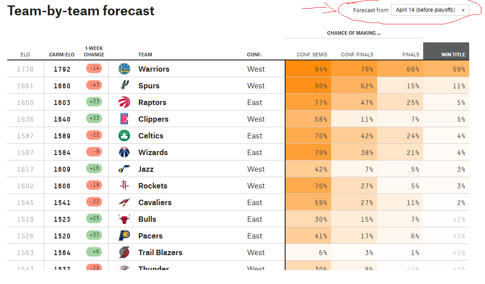

# Slow way: RSelenium


Бывают ситуации, когда разобраться в том, что "под капотом" веб-страницы не хватает времени или навыка, а данные надо скачать как можно скорее. В таких случаях спасает `Selenium` -- ПО, изначально придуманное для автоматизированного тестирования веб-приложений.  Селениум позволяет автоматизировать то, что пользователь делает мышкой и клавиатурой на сайте: нажатия на те или иные кнопки, ввод текста в формы, паузы, и так далее. При этом в любой момент мы можем сохранить то, что видим на экране, в форме HTML-файла, и работать с ним дальше средствами `rvest`.

## 5-38 NBA predictions

На сайте fivethirtyeight.com есть [раздел](https://projects.fivethirtyeight.com/2017-nba-predictions/), посвященный прогнозам баскетбольных матчей. Однажды [на StackOverflow](https://stackoverflow.com/questions/45321744/web-scrapping-in-r/45327824#45327824) пожаловались на то, что `rvest` ничего не грузит, а надо скачать прогнозы за 14 апреля. У меня получилось это сделать с помощью RSelenium, и я сейчас расскажу как.  
  
Нужно выцепить эту табличку:


Для этого расчехляем RSelenium. После загрузки библиотек и создания переменной с URL инициализируем сам движок, который будет эмулировать браузер. Для этого нужно выбрать браузер: можно использовать известные Chrome, Firefox и другие, а можно использовать браузерозаменитель phantom.js (это как будто компьютер без монитора).  
  
Некоторое время Селениум будет подгружать браузерный движок, а потом запустит окошко.
 
 


```r
library(RSelenium)
library(rvest)

url_nba <- "https://projects.fivethirtyeight.com/2017-nba-predictions/"

# Заводим движок!
rD <- rsDriver(port=4444L,browser="firefox")
remDr <- rD$client

# Переходим на нашу страницу
remDr$navigate(url_nba)

message("NAVIGATE")

# Нажимаем на бокс и находим десятую опцию (April 14 before playoffs)
# XPath был найдет с помощью всё того же просмотрщика исходного кода
webElem <- remDr$findElement(using = 'xpath', value = "//*[@id='forecast-selector']/div[2]/select/option[10]")

message("webelem")
# Говорим браузеру - нажми на это.
webElem$clickElement()
message("click")

# После нажатия сохраняем код страницы.
webpage <- remDr$getPageSource()[[1]]

# Закрываем браузер и останавливаем RSelenium
remDr$close()
rD[["server"]]$stop() 

# Теперь передаём наше хозяйство в rvest и извлекаем таблицу
webpage_nba <- read_html(webpage) %>% html_table(fill = TRUE)

# rvest извлёк три разные таблицы из страницы. Нам нужна последняя:
df <- webpage_nba[[3]]

# Приводим датафрейм в порядок
names(df) <- df[3,]
df <- tail(df,-3)
df <- head(df,-4)
df <- df[ , -which(names(df) == "NA")]
df
```


```
##     ELO Carm-ELO 1-Week Change          Team Conf. Conf. Semis Conf. Finals Finals Win Title
## 4  1770     1792           -14      Warriors  West         94%          79%    66%       59%
## 5  1661     1660           -43         Spurs  West         90%          62%    15%       11%
## 6  1600     1603           +33       Raptors  East         77%          47%    25%        5%
## 7  1636     1640           +33      Clippers  West         58%          11%     7%        5%
## 8  1587     1589           -22       Celtics  East         70%          42%    24%        4%
## 9  1587     1584            -9       Wizards  East         79%          38%    21%        4%
## 10 1617     1609           +16          Jazz  West         42%           7%     5%        3%
## 11 1602     1606           -18       Rockets  West         70%          27%     5%        3%
## 12 1545     1541           -22     Cavaliers  East         59%          27%    11%        2%
## 13 1519     1523           +25         Bulls  East         30%          15%     7%       <1%
## 14 1526     1520           +37        Pacers  East         41%          17%     6%       <1%
## 15 1563     1564            +6 Trail Blazers  West          6%           3%     1%       <1%
## 16 1543     1537           -20       Thunder  West         30%           8%    <1%       <1%
## 17 1502     1502            -3         Bucks  East         23%           9%     3%       <1%
## 18 1479     1469           +46         Hawks  East         21%           6%     2%       <1%
## 19 1482     1480           -41     Grizzlies  West         10%           3%    <1%       <1%
## 20 1569     1555           +32          Heat  East           —            —      —         —
## 21 1552     1533           +27       Nuggets  West           —            —      —         —
## 22 1482     1489           -12      Pelicans  West           —            —      —         —
## 23 1463     1472           -18  Timberwolves  West           —            —      —         —
## 24 1463     1462           -40       Hornets  East           —            —      —         —
## 25 1441     1436           +22       Pistons  East           —            —      —         —
## 26 1420     1421           -20     Mavericks  West           —            —      —         —
## 27 1393     1395            -2         Kings  West           —            —      —         —
## 28 1374     1379           -13        Knicks  East           —            —      —         —
## 29 1367     1370           +47        Lakers  West           —            —      —         —
## 30 1372     1370           -14          Nets  East           —            —      —         —
## 31 1352     1355            -9         Magic  East           —            —      —         —
## 32 1338     1348           -29         76ers  East           —            —      —         —
## 33 1340     1337           +26          Suns  West           —            —      —         —
```


